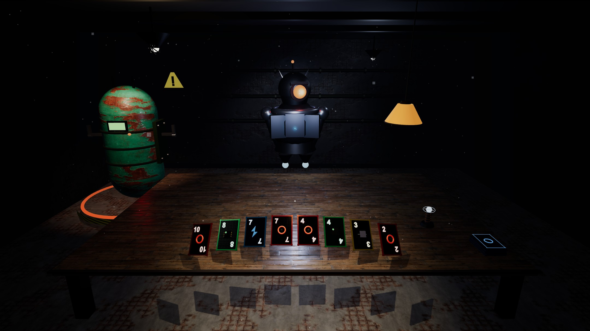
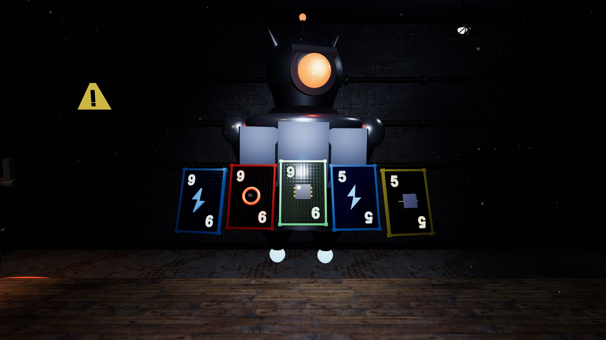
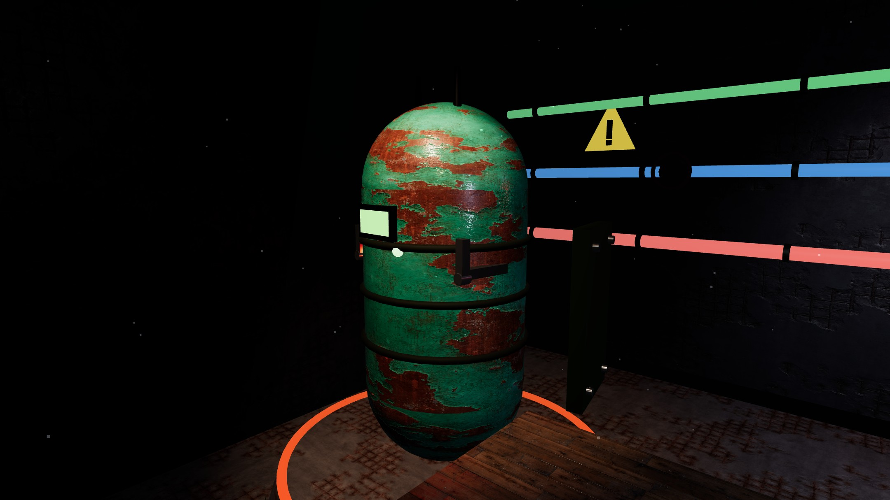
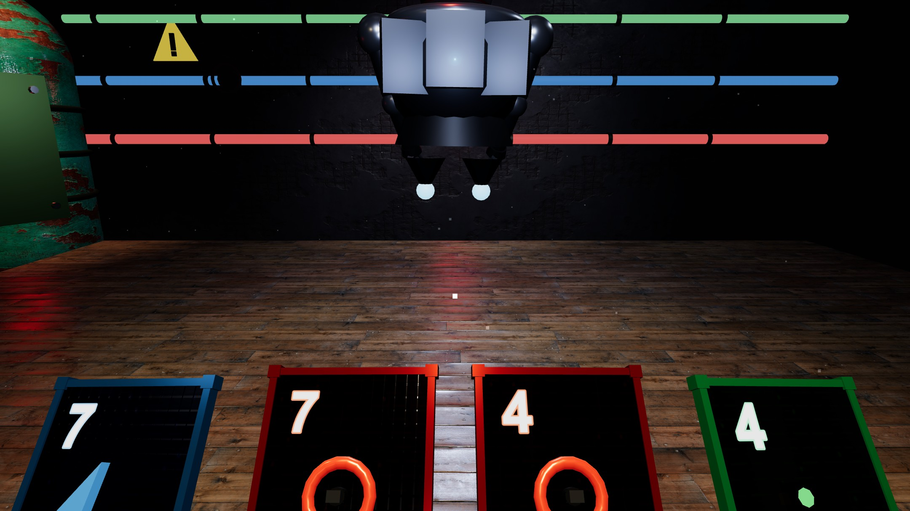
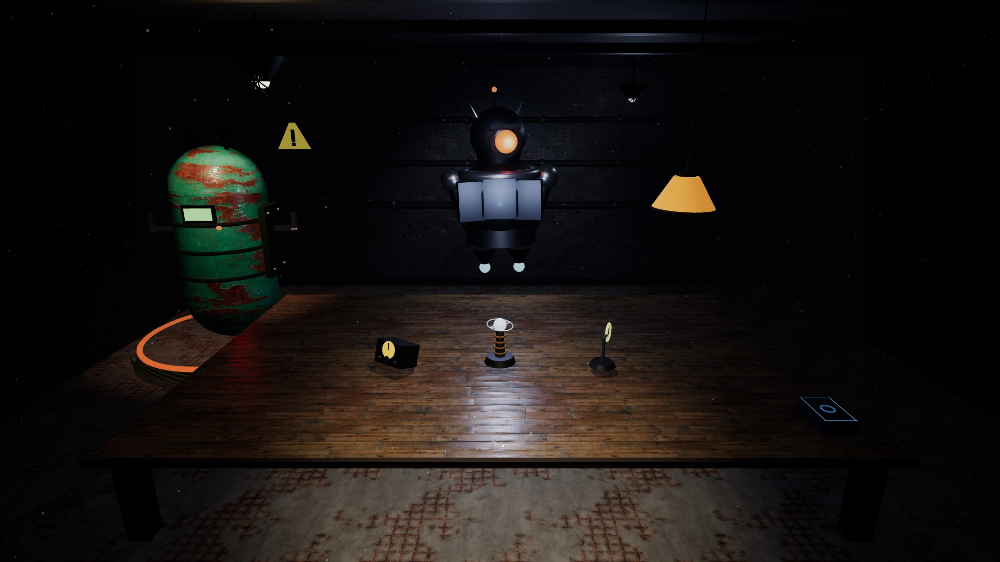

# Defuse-Deck 3D

> A turn-based card duel where you defuse a bomb by playing poker hands —
> built from scratch with **Three.js**. Procedural geometry and animation,
> a hybrid PBR texturing pipeline, and a cinematic camera.

**Defuse-Deck 3D** is a browser-based 3D puzzle / deck-builder in the style of
[*Balatro*](https://www.playbalatro.com/), set in an underground bunker. You are
a bomb-disposal operator sitting at a workbench: by playing poker combinations
with a deck of electronics-themed cards you charge a **defuse** meter. Every
turn an enemy robot, **The Warden**, actually plays its own cards to charge the
bomb's **overcharge** meter. Whoever fills their meter first wins — you defuse
the bomb, or the Warden detonates it.

Every 25% of defuse progress a module of the bomb **physically opens** (locks
snap, a panel slides out) and the camera flies in to show it, then the bomb
straightens back. If the Warden wins, the whole hierarchical model blows apart
in a radial explosion.

> Final project for the **Interactive Graphics** course — Sapienza University of
> Rome. The in-game interface is in Italian.



---

## Screenshots

| | |
|:---:|:---:|
|  |  |
| *The Warden plays a real Full House* | *Bomb at 75% defused: locks open, panel out* |
|  |  |
| *First-person view (key V)* | *Joker choice at game start* |

---

## How to play

1. Pick a difficulty in the tutorial overlay.
2. Click one of the three **jokers** on the bench — it stays with you for the
   whole match.
3. Select up to **5 cards** and **play** a poker hand to charge the green
   *defuse* bar. Reach **1400 V** before the Warden's red *overcharge* bar
   reaches its threshold.
4. The Warden draws and plays real cards back at you every turn. Survive, defuse,
   and don't let the timer run out.

Cards belong to four electronics suits — **VOLT, WIRE, CHIP, CAP** (values
2–11). Hands score exactly like Balatro:

```
total = (comboBaseChips + Σ cardValues) × comboMult
```

| Hand | Base · Mult | | Hand | Base · Mult |
|---|---|---|---|---|
| Straight Flush | 100 · ×8 | | Three of a Kind | 30 · ×3 |
| Four of a Kind | 60 · ×7 | | Two Pair | 20 · ×2 |
| Full House | 40 · ×4 | | Pair | 10 · ×2 |
| Flush / Straight | 35 / 30 · ×4 | | High Card | 5 · ×1 |

### Controls

| Input | Action |
|---|---|
| Mouse hover / click on a card | Preview / toggle selection (max 5) |
| Mouse drag on a card | Rotate it to inspect it |
| Mouse drag on the bomb | Spin the bomb around its vertical axis |
| Keys **1–8** | Toggle the *i*-th card of the fan |
| **Enter** / PLAY | Play the selected hand |
| **X** / DISCARD | Discard selection and redraw (3 per turn) |
| **S** | Re-sort the fan |
| **H** / HINT | Auto-select the best possible hand (5 per game) |
| **V** | Toggle first ⇄ third-person camera |
| **M** | Mute / unmute audio |
| Mouse drag / wheel (background) | Orbit / zoom the camera |

---

## Highlights

- **Everything geometric is code.** No 3D model is ever imported: every mesh —
  bomb, cards, the Warden, room, lamps, jokers — is assembled from Three.js
  primitives arranged in `THREE.Group` hierarchies, with pivot groups placed
  exactly where a part must rotate.
- **Cinematic camera.** Damped `OrbitControls` for free inspection, plus
  code-driven camera moves: a first ⇄ third-person transition, and a dolly-in →
  hold → dolly-out **cinematic** that frames each bomb module as it opens (the
  bomb even turns to present the opening module to the camera, then straightens
  back). All time-based and frame-rate independent, with OrbitControls suspended
  during the move so the view never drifts.
- **Hybrid texturing.** Large environment surfaces (concrete, wood, painted
  metal) use full CC0 PBR sets (color/normal/roughness/metalness); the
  gameplay-critical objects — card faces, hazard band, rank glyphs — keep
  procedurally generated Canvas textures. Reflections come from a procedural
  PMREM environment map.
- **Two animation systems.** Event-driven eased tweens (tween.js — lock snaps,
  card deals, the explosion) working alongside per-frame procedural motion
  (sine-based light flicker, idle sway, particle bursts) — no keyframe clips.
- **A real opponent.** The Warden draws its own cards and picks the best hand
  via a bitmask search over all subsets, scored with the *same* evaluator as the
  player — the rules are provably identical on both sides.
- **Hybrid audio.** A few imported mp3 samples (music, impacts) mixed with live
  Web Audio synthesis for most SFX, under a single mute toggle.
- **Raycaster interaction.** One shared `THREE.Raycaster` drives card
  hover/selection/drag, bomb drag-rotate, and joker picking.

---

## Project structure

The code is organized in four layers with a strict dependency direction — the
`core/` layer is pure game logic with **zero dependencies on the DOM or
Three.js**, so the rules are fully decoupled from presentation.

```
final-project-lakeboys/
├── index.html            # importmap + canvas + HUD markup
├── main.js               # bootstrap, wiring, requestAnimationFrame loop
├── src/
│   ├── core/             # pure logic — no DOM, no Three.js
│   │   ├── GameState.js  #   duel state, rules, pub/sub events
│   │   ├── combos.js     #   poker-hand detection & scoring
│   │   ├── EnemyAI.js    #   the Warden's "brain"
│   │   ├── jokers.js     #   score modifiers (pure functions)
│   │   └── difficulty.js #   difficulty presets
│   ├── scene/            # the 3D world
│   │   ├── SceneManager.js   # renderer, cameras, lights, camera cinematics
│   │   ├── BombModel.js      # hierarchical bomb + defuse/explosion animation
│   │   ├── EnemyModel.js     # the Warden (jointed arm chain)
│   │   ├── RoomModel.js      # bunker, lamps, back-wall progress pipes
│   │   ├── Card3D.js         # per-suit 3D cards
│   │   ├── DeckModel.js, JokerModel.js
│   │   ├── TextureFactory.js # CC0 PBR loading + procedural card/hazard/rank maps
│   │   └── config.js         # scene layout constants (single source of truth)
│   ├── systems/          # gameplay systems
│   │   ├── CardSystem.js     # 3D hands: fan layout, dealing, enemy plays
│   │   ├── InputManager.js   # raycaster picking, hover/selection/drag, keyboard
│   │   ├── AudioManager.js   # mp3 samples + Web Audio synthesis
│   │   ├── Effects.js        # camera shake, screen flash
│   │   ├── Particles.js      # THREE.Points spark bursts
│   │   ├── JokerSystem.js    # joker offer/choice
│   │   └── flight.js         # shared quadratic-Bézier arc flights
│   ├── ui/
│   │   ├── HUD.js            # DOM overlay: meters, score reveal, end screen
│   │   └── styles.css
│   └── GameManager.js    # turn orchestration (delegates every domain above)
└── public/
    ├── textures/         # CC0 PBR sets (ambientCG)
    └── sound/            # mp3 samples
```

---

## Tech stack

- **[Three.js](https://threejs.org) r167** (MIT) — renderer, scene graph,
  cameras, lights, shadows, materials, `Raycaster`, `OrbitControls`.
- **[tween.js](https://github.com/tweenjs/tween.js) 23.1.3** (MIT) — eased
  interpolation for all event-driven animations.
- Vanilla JavaScript (ES modules), no UI framework. Optional
  [Vite](https://vitejs.dev) dev server.

---

## Report

A detailed write-up of the graphics techniques and how they map to the course
requirements is in **[`REPORT.pdf`](REPORT.pdf)**.

---

## Credits

- **Environment textures:** CC0 PBR sets from [ambientCG](https://ambientcg.com)
  (*Concrete042C*, *Planks037A*, *PaintedMetal006*).
- **Music / impact samples:** used for non-commercial academic purposes.

